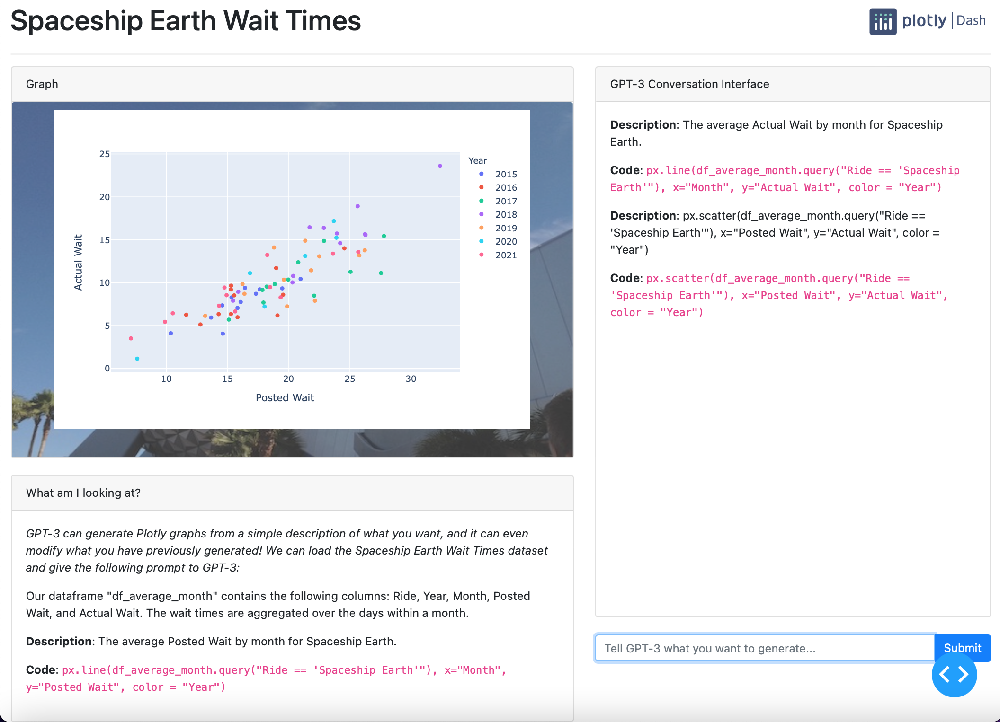

# Dash GPT-3 Line Charts: Walt Disney World

This is an app using GPT-3 to create line charts of wait times at Walt Disney World using natural language. This app is built starting from the sample app provided at this [repository](https://github.com/plotly/dash-sample-apps/tree/main/apps/dash-gpt3-lines). Currently, the app incorporates data regarding Spaceship Earth at Epcot. The dataset was retrieved in January 2022 from [TouringPlans.com](https://touringplans.com/walt-disney-world/crowd-calendar#DataSets).

This first graph shows the Posted Wait by year across months for Spaceship Earth. The wait is averaged over all recorded waits within that year and month. One observation is that the wait times are noticeably lower in September across all years. This may indicate lower visitation rates to Epcot during September. Perhaps this is a good time for an event to attract guests, for example the Food and Wine Festival.


This now shows the Actual Wait instead of the Posted Wait. The trends are similar to those of the Posted Wait times.


We can look at the Actual Wait versus the Posted Wait to investigate how accurate the Posted Wait times are. We see that the Posted Wait times tend to be lower than the Actual Wait times. Findings from the decision sciences have demonstrated that people think in terms of reference points: they anchor based on their expectations, and experience utility based on the deviation of reality from the expectation. Therefore, a Posted Wait of 30 minutes with an Actual Wait of 20 minutes would make guests happy, while a Posted Wait of 10 minutes with an Actual Wait of 20 minutes would make guests upset. Even though the objective wait time is the same, the subjective experience is not. Therefore, Disney should have higher Posted Waits than Actual Waits to appeal to these insights from the behavioral sciences.



The dataset can be changed to look at the wait times for other rides at Walt Disney World and the other Disney parks for further investigation.

# Sample App from Plotly

This section corresponds to the original [sample app](https://github.com/plotly/dash-sample-apps/tree/main/apps/dash-gpt3-lines) from Plotly. The documentation for that app is repeated here, as the instructions for using GPT-3 and for cloning the repository apply.


[Try it now](https://dash-gallery.plotly.host/dash-gpt3-lines/)


This demos shows how to use GPT-3 to not only generate line charts using a given dataset (in this case, the [Gapminder dataset](https://plotly.com/python/plotly-express/)), but also update it in real time with only natural language queries:


It only took one Plotly Express code snippet (given in the card on the bottom left) for it to learn how to generate line charts.

For a smoother demo, [watch the video here](https://youtu.be/baAXmxcyZo4).

## OpenAI GPT-3 API Access

In order to obtain access to the GPT-3 API, you will need to [join the waitlist](https://beta.openai.com/). Once you have the API,  you can find the secret key in [the quickstart](https://beta.openai.com/developer-quickstart), and export it as an environment variable:
```
export OPENAI_KEY="xxxxxxxxxxx"
```
Where "xxxxxxxxxxx" corresponds to your secret key.


## Instructions

To get started, first clone this repo:
```
git clone https://github.com/plotly/dash-sample-apps.git
cd dash-sample-apps/apps/dash-gpt3-bars
```

Create a conda env:
```
conda create -n dash-gpt3-bars python=3.7.6
conda activate dash-gpt3-bars
```

Or a venv (make sure your `python3` is 3.6+):
```
python3 -m venv venv
source venv/bin/activate  # for Windows, use venv\Scripts\activate.bat
```

Install all the requirements:

```
pip install -r requirements.txt
```

You can now run the app:
```
python app.py
```

and visit http://127.0.0.1:8050/.


## Discussions

If you are interested in chatting with us about the technical aspect of this, or would like to share the Dash apps you created with your own OpenAI API tokens, [join the discussion thread](https://community.plotly.com/t/automatically-generate-plotly-charts-using-gpt-3/42826).


## GPT-3 for Enterprises

If you are interested to use Dash and GPT-3 in an enterprise setting, please [reach out](https://plotly.com/contact-us/), and we'd be happy to discuss how we can help with [Dash Enterprise](https://plotly.com/dash/).
